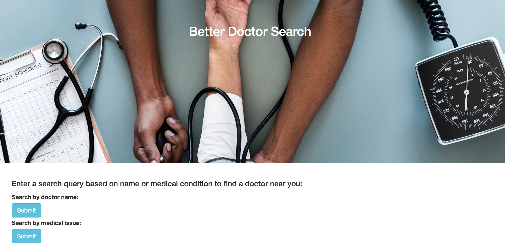

# _Better Doctor Search_

##### Epicodus - JS Week 2- Code Review - 03/23/2018

## _By Maggie Summers_

## Description

An application that suggests doctors based on name and medical condition.

<kbd></kbd>


## Behavior

| Spec | Input | Output |
| :---------------| :---------------| :---------------|
| A user should be able to enter a medical issue to receive a list of doctors in the Portland area that fit the search query. | "toothache" | A list of doctors that treat toothaches |
| A user should be able to to enter a name to receive a list of doctors in the Portland area that fit the search query. | "Dave" | A list of doctors who have the name "Dave" |
| If the query response includes any doctors, the following information should be included about each doctor: first name, last name, address, phone number, website and whether or not the doctor is accepting new patients. | "Scott" | "Scott Smith" "1555 Happy Lane" "555-555-5555", "www.google.com", Yes |
| If the API call results in an error (any message not a 200 OK), the application should return a notification that states what the error is. | clicks Submit | "400 error handling your request - Bad Request" |
| If the query response doesn't include any doctors (for instance, if no doctors meet the search criteria), the application returns a notification that states that no doctors meet the criteria. | "Nugget" | "There are no doctors matching your search." |

## Technologies Used

```
Application: JavaScript, jQuery, Bootstrap, HTML
Testing: Jasmine, Karma
Environment: npm, webpack, babel, esLint
API: BetterDoctor
```

## Installation

```
$ git clone https://github.com/summersmaggie/doctor-lookup
```

_Requires node.js; instructions to install:_ https://www.learnhowtoprogram.com/javascript/getting-started-with-javascript-2f9a73dc-b7f5-4a22-9101-e69d49f552ac/installing-node-js

Install required npm packages and dependencies:

```
$ npm install
$ npm run build
```

Register at BetterDoctor to receive API key at URL below. Place in .env file.

```
https://developer.betterdoctor.com/
```

Start the webserver:
```
$ npm run start
```

## Known Bugs

 _No known bugs at this time._

## Support and contact details

 _To suggest changes, submit a pull request in the GitHub repository._

## License

 _Licensed under MIT license_

Copyright 2018 **Maggie Summers**
